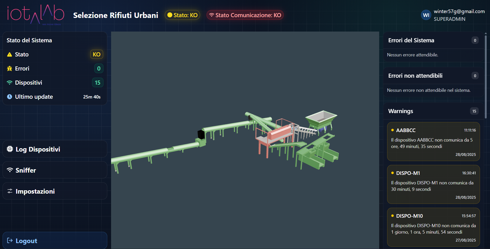
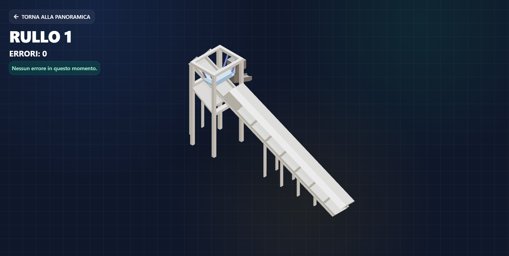
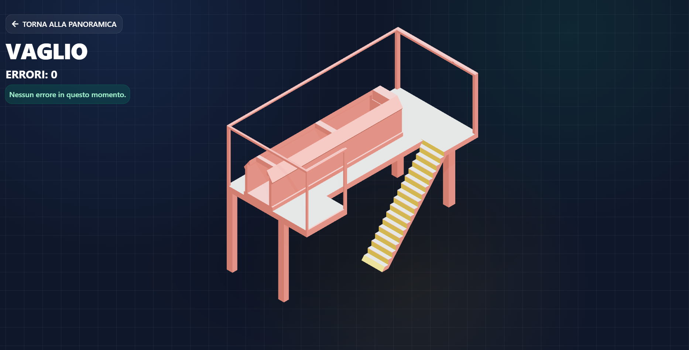
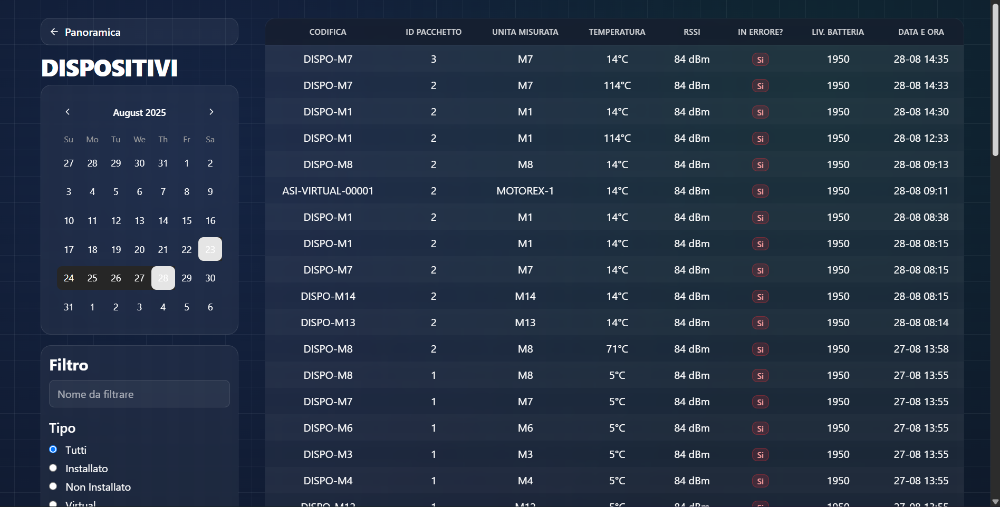
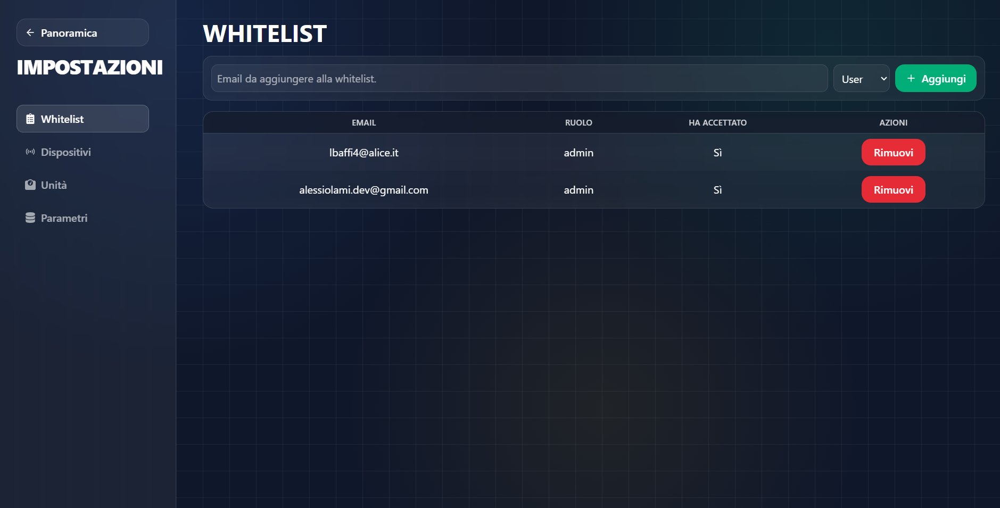
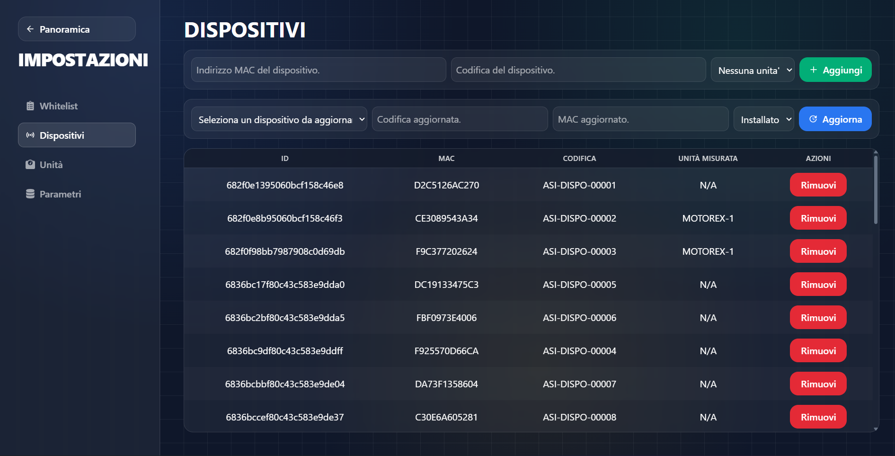
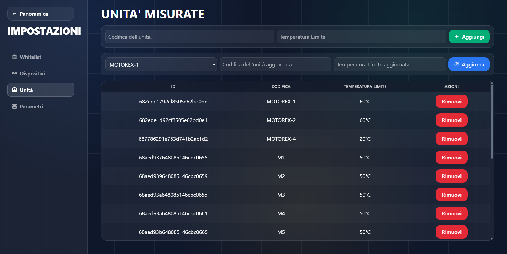
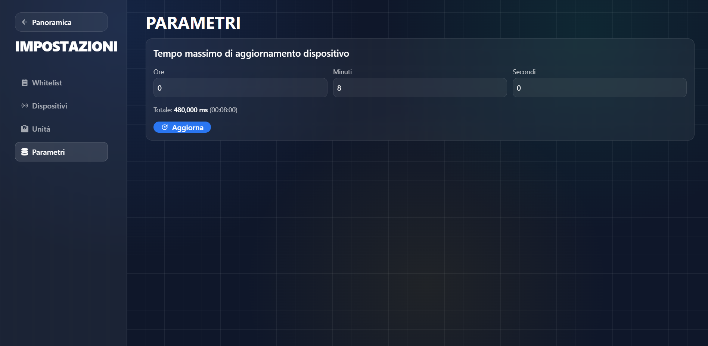
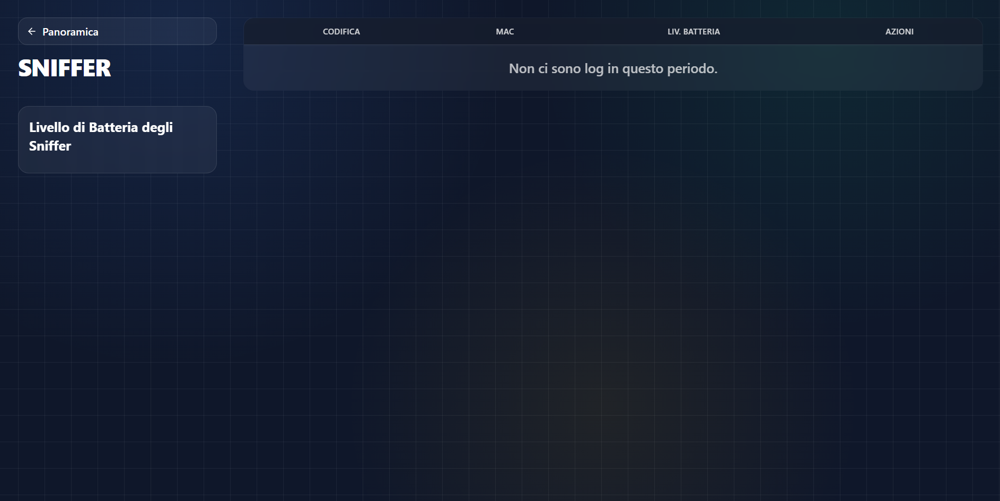

# Asite Frontend
Il frontend di asite serve a monitorare l'impianto di selezione dei rifiuti urbani.

Panoramica impianto

Overview dettagliata Nastro Trasportatore

Overview dettagliata Vaglio

Log Dispositivi

Whitelist

Dispositivi

Unità

Parametri

Sniffer